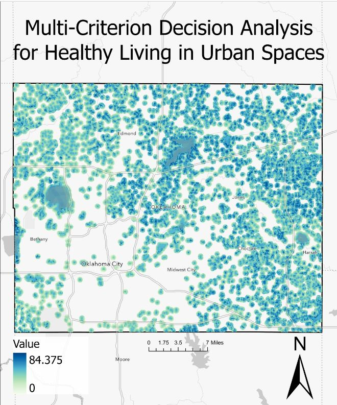
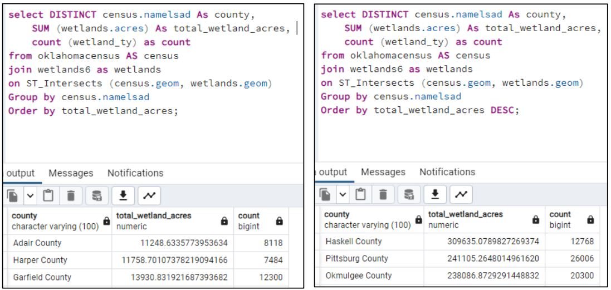
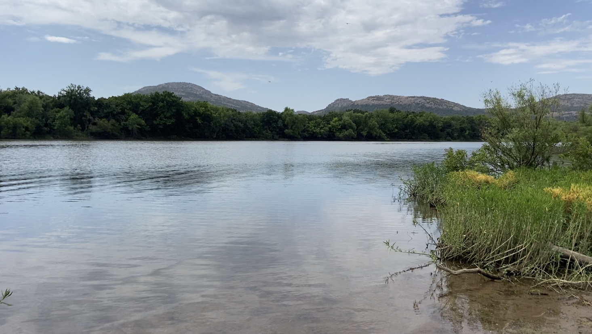
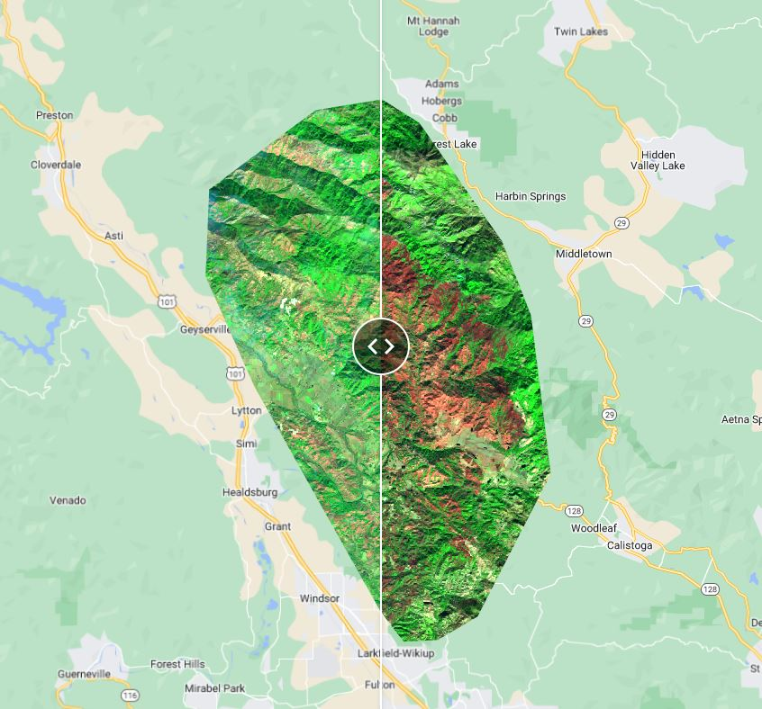
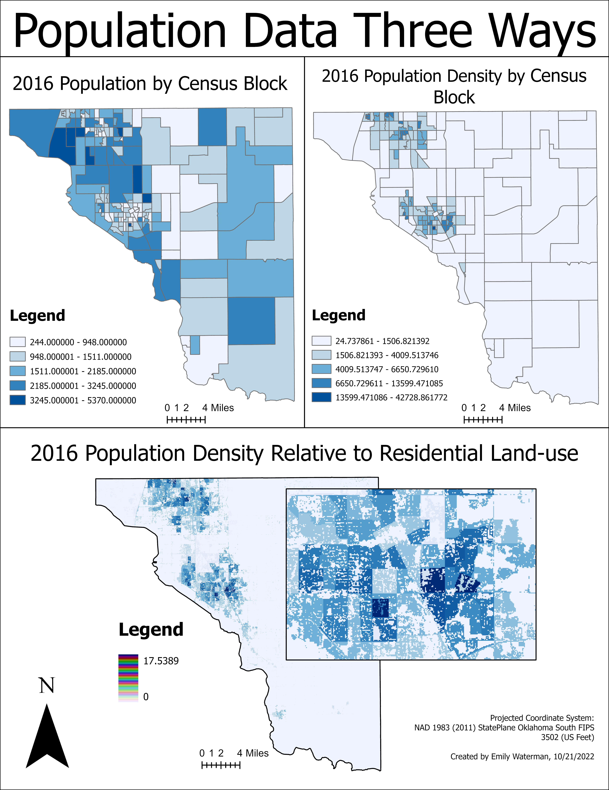

## Portfolio

---

### Projects

[Geospatial MCDA](https://storymaps.arcgis.com/stories/2eab443900e94a1f814f346d7934677d/)
 

---
[Wetland PostGIS Analysis through PgAdmin](/pdf/FinalProjectReport.pdf)

---
[Work Report COMING SOON need Approval](http://example.com/)

---

### Maps/ Apps

Google Earth Engine Applications
 
[Pre and Post Fire App](https://ewaterman.users.earthengine.app/view/burnedbanda/)

---
Population Data by Land Use
- 

---
- [Project 2 Title](http://example.com/)
- [Project 3 Title](http://example.com/)
- [Project 4 Title](http://example.com/)
- [Project 5 Title](http://example.com/)

---

---

Page template forked from <a href="https://github.com/evanca/quick-portfolio">evanca</a>

<!-- Remove above link if you don't want to attibute -->
